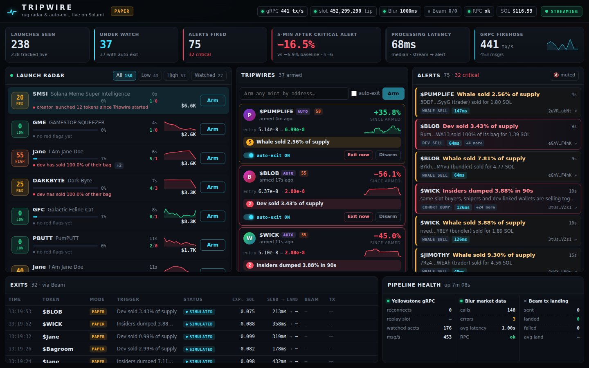

# Tripwire

**Live rug radar and auto-exit for Solana launches, built on Solami.**

Most memecoin holders lose money to a small number of wallets: the dev, the wallets that bought in the launch slot (bundlers), and the wallets that bought a few slots later (snipers). Those wallets usually move first. The dev splits supply into fresh wallets, the bundle sells together, then the chart goes vertical down. All of this is visible on-chain seconds before the bottom, but no human is watching every launch.

Tripwire watches them for you:

1. **Launch Radar.** Every pump.fun launch is picked up from Solami's Yellowstone gRPC stream the moment it lands. Tripwire reconstructs its cohorts itself (dev, bundlers, snipers, wallets the dev funds with tokens) and gives it a 0–100 risk score with the reasons spelled out.
2. **Tripwires.** Arm any token, or let Tripwire auto-arm the ones gaining traction. Rules fire when the dev sells, the dev moves supply to fresh wallets, insiders dump together, liquidity is pulled, a whale exits, or price crashes. Tripwire follows the money: a wallet the dev sends tokens to is treated as the dev.
3. **Auto-exit via Beam.** On a critical alert, Tripwire can sell your position. It builds the swap from Jupiter's instructions, adds a Beam tip, signs it with your wallet, and lands it through Solami's Beam, then reads Beam's landing record back. Paper mode (the default) quotes and simulates instead.
4. **Honest proof.** After every alert, Tripwire records the signed price move at +1 and +5 minutes. The dashboard compares the median 5-minute move after critical alerts with a baseline: the same watched tokens sampled at random times. It does not show a cherry-picked "loss avoided" figure.

### Proof on mainnet

`npm run beam-test` buys a tiny position and sells it with Tripwire's real exit code, both sent through Beam. Run on 2026-10-01:

| Step | Result | Transaction |
|---|---|---|
| Buy 0.003 SOL of STONK via Jupiter + Beam | landed in 633 ms | [2cYxU6…jwHh7s](https://solscan.io/tx/2cYxU6mQ1NrUheo75jQqRd3ykZJGbvyThVjm1mc2mpaGDLZCG5bsHHYK4kG3YUs5FY2gfMfxts4o7558H4jwHh7s) |
| Exit via `Exiter.exit()` (live mode) + Beam | trigger → send 380 ms, landed in 544 ms | [2F8nEw…ns8fbPG](https://solscan.io/tx/2F8nEwyBL7Vz1BCqqutR2Ec9P7EBkgUsPUVAUK7Em3d2dvBN9CEudjqekqhyBmo9c1RtwnvDRwehzv1akns5fbPG) |

Beam's own record (`GET /swqos/tx/{signature}`): `is_landed: true`, region `nyc`, tip 100,000 lamports, held 2 ms before forwarding.



## How Solami is used

| Solami product | What it does in Tripwire |
|---|---|
| **Yellowstone gRPC** (`grpc.solami.dev`) | The main data path. One processed-commitment stream carries every pump.fun and PumpSwap transaction (~500–1,500 tx/s), plus a filter that is updated live for watched mints and dev-side wallets. That filter is what catches plain token transfers when the dev splits supply. On reconnect, the stream resumes from the last processed slot with `from_slot`, so a dev's sell is never missed. |
| **Blur REST** (`/data/token/intel`, `security`, `dev`, `first-buyers`, `/data/wallet/cluster`, `creation`) | Deepens the score for watched tokens: mint/freeze authority, Blur's own cohort holdings, the dev's launch history (serial launcher?), and whether the first buyers were funded by the same wallet or by the dev. Also names tokens Tripwire did not see launch. |
| **RPC** (`rpc.solami.dev`) | Wallet balances, address lookup tables, blockhash, simulation, signature status for exits. |
| **Beam** | Exits are sent as `sendTransaction` on Solami RPC with a transfer to a tip account from `/onchain/tip-addresses`, which routes them through Beam. Tripwire then reads `/swqos/tx/{signature}` for region, Jito path, tip and hold time. |
| **Leader tracking** (`/leader-tracking/current`) | The chain tip, so the health panel can show how many slots the stream is behind. |

The gRPC decoder needs no per-DEX instruction parsing. It derives buys, sells, transfers, pool and bonding-curve prices, and pump.fun curve progress from each transaction's pre- and post-balances. It decodes pump.fun's `CreateEvent` for name and symbol, and detects `Migrate` for graduation. See [`src/engine/decode.ts`](src/engine/decode.ts).

## Quick start

Requires Node 20+.

```bash
git clone https://github.com/MHVVD/superteam tripwire && cd tripwire
npm install
cp .env.example .env          # put your Solami key in SOLAMI_API_KEY
npm run doctor                # checks which Solami products the key can reach
npm start                     # http://127.0.0.1:8787
```

Within a few seconds the radar starts filling with live launches. Auto-watch arms tripwires on tokens that reach 15% bonding-curve progress with 15+ buyers, so alerts start arriving within a minute or two.

Get a key at [solami.dev](https://solami.dev/signup?ref=st-earn-sep-26). The Pro trial covers everything here. The key's role needs:

| Permission | Needed for |
|---|---|
| gRPC | Everything (required) |
| DataApi | Blur enrichment. Optional, and the health panel shows it as off without it. |
| RPC | Exits: simulation in paper mode with a wallet, and all live exits |

If your permissions are on different keys, set `SOLAMI_GRPC_KEY`, `SOLAMI_DATA_KEY` and `SOLAMI_RPC_KEY` separately.

With a gRPC-only key Tripwire still runs the radar and tripwires; the health panel shows Blur as off and RPC as off, paper exits are quoted by Jupiter without simulation, and live exits are impossible. `npm run doctor` tells you exactly which products your key reaches.

### Prove a real exit (optional, ~0.003 SOL)

```bash
npm run beam-test                               # first run: generates a burner wallet into .env and prints its address
# send it ~0.02 SOL, then:
npm run beam-test -- <liquid token mint> 0.003  # buy, then exit via Tripwire's exit path, both through Beam
```

### Docker

```bash
docker build -t tripwire .
docker run --rm -p 8787:8787 --env-file .env -e HOST=0.0.0.0 tripwire
```

## Configuration

All settings are environment variables. See [`.env.example`](.env.example) for the full list with comments.

| Variable | Default | Meaning |
|---|---|---|
| `SOLAMI_API_KEY` | required | Your Solami key |
| `SOLAMI_REGION` | nearest | Pin `nyc`, `fra` or `ams` |
| `AUTO_WATCH` | `true` | Auto-arm tripwires on launches with traction |
| `AUTO_WATCH_MIN_PROGRESS` / `_MIN_BUYERS` / `_MAX` | `15` / `15` / `40` | Auto-arm thresholds and cap |
| `EXIT_MODE` | `paper` | `paper` or `live` |
| `WALLET_SECRET_KEY` | none | Base58 or JSON array. **Use a burner.** |
| `EXIT_MAX_SOL` | `0.5` | Refuse any single exit worth more than this |
| `BEAM_TIP_LAMPORTS` | `100000` | Beam tip; 0.0001 SOL minimum |
| `AUTO_WATCH_AUTO_EXIT` | `true` in paper mode, `false` in live | Auto-watched tokens also auto-exit |
| `PAPER_SIZE_SOL` | `0.1` | Position size used to quote paper exits |
| `TRIPWIRE_TOKEN` | generated when needed | API token. Required whenever `HOST` is not loopback; if unset, a random one is printed at startup as `?token=…` |
| `TELEGRAM_BOT_TOKEN` / `TELEGRAM_CHAT_ID` / `DISCORD_WEBHOOK_URL` | none | Push critical alerts and exits |

Exits only sell tokens the wallet already holds; Tripwire never buys. In live mode an exit is refused when Jupiter can't quote it or when it would exceed `EXIT_MAX_SOL`. Each watch auto-exits at most once.

## What the score and rules mean

**Roles** are assigned from slot timing relative to the create transaction:

- `dev`: the creator.
- `bundler`: bought in the creation slot.
- `sniper`: bought within 5 slots of the creation slot.
- `linked`: received tokens from the dev side by plain transfer.
- `trader`: everyone else.

**Risk flags** (weights add up to a score capped at 100):

| Flag | Fires when |
|---|---|
| bundled | bundlers bought ≥3% (warning) / ≥10% (danger) of supply |
| sniped | snipers took ≥8% / ≥20% |
| dev_bag | dev bought ≥10% at launch |
| dev_selling / dev_dumped | dev sold ≥10% / ≥50% of their bag |
| dev_moved | dev sent ≥0.5% of supply to other wallets |
| insiders_hold | dev + bundlers + snipers + linked still hold ≥12% / ≥25% |
| collapsed | price ≥70% below its high |
| Blur: rugged, mint/freeze authority, concentrated, serial_launcher, dev_funded_buyers, cluster | from the Blur endpoints above |

**Tripwire rules** (per watched token, 60s cooldown each):

| Rule | Severity | Default trigger |
|---|---|---|
| `dev_sell` | critical | dev or a dev-linked wallet sells ≥25% of its bag or ≥1% of supply |
| `cohort_dump` | critical | insiders sell ≥3% of supply within 90s |
| `lp_pull` | critical | a wallet withdraws token + SOL from a graduated pool |
| `crash` | critical | price ≥35% below its 90s high |
| `dev_transfer` | warning | dev sends ≥0.5% of supply to other wallets |
| `whale_sell` | warning | one sell ≥2% of supply worth ≥0.1 SOL |

**Outcomes.** Each alert records `move1m` and `move5m`, the signed price change 1 and 5 minutes after it fired. Every 30s Tripwire also notes the price of each watched token and records its move 5 minutes later. That is the baseline. The dashboard tile shows the median 5-minute move after critical alerts next to the median baseline move. `avoidedPct`, the lowest price within 10 minutes, is kept as a best-case figure in tooltips only.

**Noise control.** After a critical alert, further critical triggers on the same token within 5 minutes are folded into it (`suppressed`). Warnings have a 60s cooldown per rule.

## Architecture

```
Solami gRPC ─► decode.ts ─► LaunchTracker ─► scorer ─► Launch Radar
 (pump.fun, PumpSwap,          │
  watched mints/wallets)       └─► tripwires ─► alerts ─► dashboard · Telegram · Discord
                                            └─► Exiter ─► Jupiter swap-instructions
Solami Blur REST ─► enrichment ─┘                        + Beam tip ─► Solami RPC/Beam
Solami leader tracking ─► health
```

```
src/
  engine/decode.ts     gRPC tx → launches, migrations, per-wallet flows, prices
  engine/tracker.ts    per-launch state, roles, follow-the-money
  engine/scorer.ts     risk flags and score
  engine/tripwires.ts  rules, cooldowns, "avoided" follow-up
  engine/exit.ts       Jupiter + Beam exits, paper/live
  solami/grpc.ts       Yellowstone client: live filter updates, from_slot replay, watchdog, stats
  solami/blur.ts       Blur REST client with retries and concurrency limit
  solami/beam.ts       tip accounts, send + confirm, landing lookup
  app.ts               wiring, auto-watch, health
  server.ts            static dashboard, SSE stream, JSON API (docs/API.md)
web/                   dashboard (Preact + htm vendored, no build step)
test/                  vitest, including real mainnet transactions in test/fixtures
```

The API key stays on the server; the browser only talks to the local API.

## API

The dashboard uses a small local API (full contract in [docs/API.md](docs/API.md)):

```bash
curl -s localhost:8787/api/snapshot | jq '.health.stats'
curl -s -X POST localhost:8787/api/watch -H 'content-type: application/json' -d '{"mint":"<mint>","autoExit":false}'
curl -s -X POST localhost:8787/api/exit/<mint> -H 'content-type: application/json' -d '{}'
curl -s -X DELETE localhost:8787/api/watch/<mint>
curl -N localhost:8787/api/stream            # Server-Sent Events: launch, alert, watch, exit, health
```

Mutating calls must be `application/json`, and a browser `Origin` must match the host. Together these block other websites from triggering exits. Add `-H 'x-tripwire-token: …'` when a token is set.

## Development

```bash
npm test          # decoder on captured mainnet txs, tracker, scorer, tripwire rules
npm run typecheck
npm run dev       # restart on change
npm run capture   # record live gRPC transactions into test/fixtures for regression tests
```

`web/index.html?demo=1` renders the dashboard with generated data when no backend is running, which is useful for UI work.

## Limitations

- pump.fun curves quoted in a token other than SOL are tracked but not priced.
- USD figures use Jupiter's SOL price and are cosmetic; all rule math is in SOL and raw token amounts.
- Same-slot buyers include fast bots, not only bundles controlled by the dev. The score weighs them, but alone they are not proof of a rug.

- Cohorts are only reconstructed for tokens launched while Tripwire is running. For older tokens you arm by hand, the dev comes from Blur (or `devWallet` in `POST /api/watch`), and bundler/sniper roles come from Blur intel where available.
- Radar covers pump.fun launches (and PumpSwap after graduation). Tokens armed by hand on other DEXes are tracked through their mint subscription.
- Prices come from pool balances in the transactions themselves, so a token that is not trading has no fresh price.

## License

MIT
